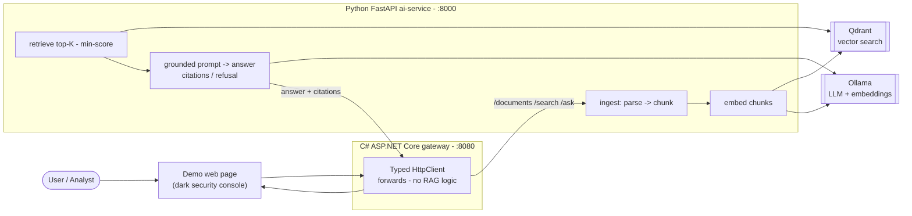

# SentinelBrief

[](https://github.com/akupiectdc/sentinelbrief/actions/workflows/ci.yml)

SentinelBrief is a local/on-premise cyber intelligence RAG workbench. It indexes
cybersecurity documents (public CERT publications, public reports, and synthetic
internal security procedures) and answers questions using only retrieved
evidence. It returns citations and refuses to answer when the indexed documents
do not provide enough evidence.

The project is intentionally **local-only** in the MVP to demonstrate
on-premise LLM architecture: no cloud LLM providers are used or implemented.


## Architecture



```
client -> C# web-api (gateway) -> Python ai-service (RAG core) -> Ollama + Qdrant
```

* **C# ASP.NET Core (`src/web-api`)** - thin API gateway. Forwards AI work to the
  Python service. Contains no RAG logic. Also serves the demo web page.
* **Python FastAPI (`src/ai-service`)** - the AI/RAG core. Owns document parsing,
  chunking, embeddings, vector search, retrieval, prompt building and answer
  generation.
* **Ollama** - local LLM and embedding provider.
* **Qdrant** - local vector database.

See [docs/architecture.md](docs/architecture.md) for detail.

## Tech stack

* Python 3.11+ with [uv](https://docs.astral.sh/uv/) for dependency management
* FastAPI, Pydantic, Pydantic Settings, httpx, qdrant-client
* C# / .NET 8 ASP.NET Core Minimal API
* Ollama (local LLM + embeddings)
* Qdrant (local vector search)
* Docker Compose for the local stack
* GitHub Actions for CI

## Getting started

### Prerequisites

The same tools exist on every platform; only the install command differs.

* [uv](https://docs.astral.sh/uv/) - Python dependency manager
* .NET 8 SDK
* Docker - Docker Engine (Linux) or Docker Desktop (macOS / Windows), for Qdrant
* [Ollama](https://ollama.com/) for the local LLM + embeddings
  * macOS: `brew install ollama` (or the app from ollama.com)
  * Linux: `curl -fsSL https://ollama.com/install.sh | sh`
  * Windows: download the installer from ollama.com (it runs Ollama
    automatically in the background - no `ollama serve` needed)

The first two steps are identical everywhere:

```bash
git clone https://github.com/akupiectdc/sentinelbrief.git
cd sentinelbrief
cp .env.example .env          # Windows PowerShell: copy .env.example .env
```

You also need the two Ollama models once (same on every platform):

```bash
ollama pull llama3.1:8b          # chat model (~4.7 GB, one-time)
ollama pull nomic-embed-text     # embedding model (~274 MB, one-time)
```

Then follow the section for your OS below.

### Run it locally - macOS / Linux

```bash
# 1. Start the infrastructure
docker compose up -d qdrant      # vector DB on :6333
ollama serve &                   # local model server on :11434

# 2. Start both services and seed the demo corpus (one command)
./scripts/dev.sh
```

Then open <http://localhost:8080> and ask a question. `Ctrl-C` in that terminal
stops both services.

**Stopping** (reverse order - apps first, then infrastructure):

```bash
# 1. Apps: press Ctrl-C in the ./scripts/dev.sh terminal (cleans up both servers).
#    If that terminal is gone, kill the apps by port instead:
lsof -ti :8000 -ti :8080 | xargs kill

# 2. Ollama
pkill ollama

# 3. Qdrant (keeps the data volume)
docker compose stop
```

### Run it locally - Windows (PowerShell)

Ollama already runs in the background after install, so you only start Qdrant
and the apps:

```powershell
# 1. Start the database (Docker Desktop must be running)
docker compose up -d qdrant      # vector DB on :6333

# 2. Start both services and seed the demo corpus (one command)
./scripts/dev.ps1
```

If Windows blocks the script the first time, allow local scripts once:

```powershell
Set-ExecutionPolicy -Scope CurrentUser -ExecutionPolicy RemoteSigned
```

Then open <http://localhost:8080> and ask a question. `Ctrl-C` in that terminal
stops both services.

**Stopping** (reverse order - apps first, then infrastructure):

```powershell
# 1. Apps: press Ctrl-C in the ./scripts/dev.ps1 terminal (cleans up both servers).
#    If that terminal is gone, kill the apps by port instead:
Get-NetTCPConnection -LocalPort 8000,8080 | ForEach-Object { Stop-Process -Id $_.OwningProcess -Force }

# 2. Ollama (optional - it normally runs as a background service)
Stop-Process -Name ollama -Force

# 3. Qdrant (keeps the data volume)
docker compose stop
```

Neither path deletes data: Qdrant's vectors live in the `qdrant_storage` Docker
volume and Ollama's models stay on disk, so the next start needs no re-download.

### Run the two services individually (any OS, for development)

The Python project lives in `src/ai-service` (its `pyproject.toml` and `uv.lock`
are there). Recreate the exact locked environment with `uv sync` from that
directory; `uv` creates a local `.venv` and installs the pinned dependencies.

```bash
# ai-service (auto-reload) - terminal 1
cd src/ai-service && uv sync && uv run uvicorn app.main:app --reload --port 8000
# gateway - terminal 2
cd src/web-api && dotnet run --project SentinelBrief.WebApi
```

### Alternative: everything in Docker

```bash
docker compose up --build
docker compose exec ollama ollama pull llama3.1:8b
docker compose exec ollama ollama pull nomic-embed-text
```

> On macOS, prefer the local path above: the Docker Ollama runs CPU-only, and the
> bundled `ollama` container ships without models (you pull them into it).

To stop this all-in-Docker stack, run `docker compose down` (add `-v` to also
delete the Qdrant and Ollama volumes).

## Demo (web UI)

The C# gateway serves a small demo page at <http://localhost:8080>.

`./scripts/dev.sh` already seeds the demo corpus. If you started the services
some other way, seed it manually first:

```bash
uv run --project src/ai-service python scripts/seed_demo.py   # defaults to the ai-service at :8000
```

Then open <http://localhost:8080> and ask a question (or click an example).

The page calls the gateway's `/ask` endpoint and shows the grounded answer with
its citations and scores - or a clearly styled refusal when the indexed
documents do not support the question.

The demo recording at the top of this README shows the full flow. See
[docs/demo-script.md](docs/demo-script.md) for a recording walkthrough.

## Health checks

```bash
curl http://localhost:8000/health
curl http://localhost:8080/health
```

## Tests

Python:

```bash
cd src/ai-service
uv run pytest
```

C#:

```bash
cd src/web-api
dotnet test
```

Unit tests do **not** require Ollama, Qdrant, network access, secrets, or any
cloud API.

## What works now

* Repository structure and documentation
* Python ai-service: config (restricted-mode aware), structured logging, health
  endpoint, TXT/Markdown parsing, character-based chunking, and Pydantic models
* Document ingestion: `POST /documents` parses -> chunks -> embeds each chunk via
  Ollama -> stores vectors in Qdrant, and keeps metadata for `GET /documents` and
  `GET /documents/{id}`
* Local Ollama embeddings behind a provider abstraction, with
  `POST /embeddings/preview` to verify against a running Ollama
* Qdrant vector storage (`QdrantVectorStore`, cosine distance)
* Retrieval: `POST /search` embeds the query, runs top-K similarity search in
  Qdrant, filters by `MIN_RETRIEVAL_SCORE`, and returns chunks with scores and
  source metadata
* Evidence-based answering: `POST /ask` retrieves evidence, builds a grounded
  prompt, calls the local Ollama chat model, and returns an answer with
  citations and retrieved titles - or the fixed refusal message when there is
  insufficient evidence
* C# web-api gateway: forwards `/documents` (ingest/list/get), `/search`, and
  `/ask` to the ai-service via a typed HttpClient (snake_case <-> PascalCase
  mapping, 502 on downstream failure). No RAG logic in C#.
* Unit tests for both services (no Ollama/Qdrant required - embedding/vector/chat
  dependencies are faked, the vector store is tested via qdrant-client's
  in-memory mode, and the gateway is tested with a stubbed downstream handler)
* Docker Compose stack and GitHub Actions CI

The full local RAG flow works end-to-end, through the gateway:
**client -> C# gateway -> Python core -> ingest -> embed -> store -> retrieve ->
grounded answer with citations (or refusal).**

## What is not implemented yet

* PDF parsing (TXT/Markdown work today)

## Documentation

* [docs/architecture.md](docs/architecture.md)
* [docs/data-sources.md](docs/data-sources.md)
* [docs/security-notes.md](docs/security-notes.md)
* [docs/demo-script.md](docs/demo-script.md)
* [docs/github-actions.md](docs/github-actions.md)
